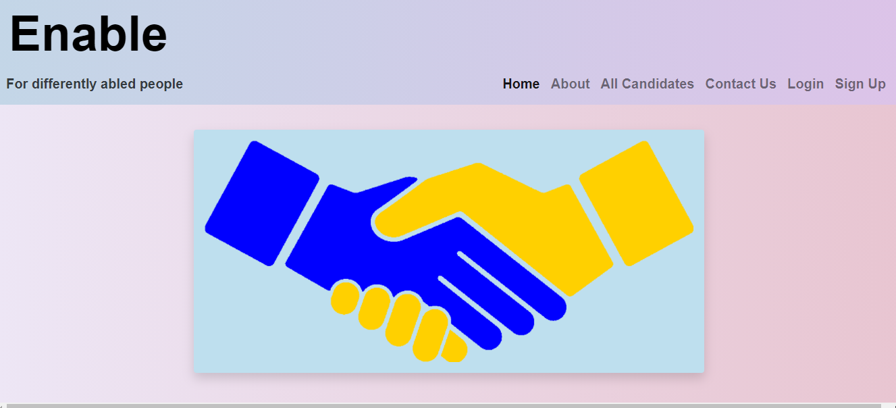
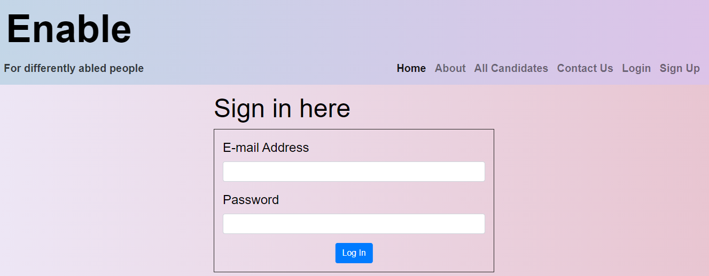
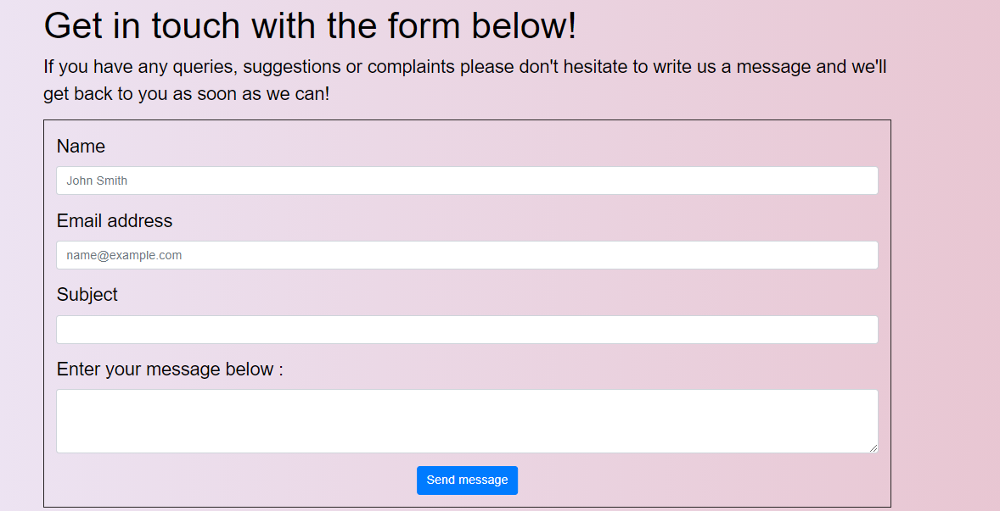
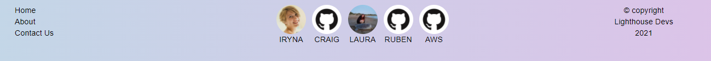

# team name
Click [here](https://upsidedownrecruitment.herokuapp.com/) to view the live web site 

## Goals
To create a recruitment site for people with down syndrome.
Currently in Ireland there is a very small number of people with down syndrome in the work place.
We aim to create a site that gives them a place to find work and employers a place to find and recruit them.
As our MVP we aim to:
* Create an easy to navigate web site for job seekers and employers
* Create a site that allows possible access arrangements to the work place and the interview to be arranged.

### To achieve these goals I will need to:
* Create a website with good accesbility
* Easy to understand site structure and flow
* Ensure the sign up section is clear and easy to find
* Create a UX design that is intuitive to use and flows well
* The users will:
    * Be looking to find work
    * Be able to quickly navigate the site and create a simple profile
    * be able to add any extra arrangments they may need.

## Wireframes for Original Concept

### First Draft of Home Page

### First Draft of login Page

### First Draft of login Page 2 

### First Draft of Contact Page

### First Draft of user profile Page

 

## Functionality

## Load Screen/home page

The user can see what services are offered by the narrator in the About section, and can see clear navigation options to the Samples section and the Contact section. There is also a call to action at the end of the About section, so the user can be directed to the Contact page. This will make it easier for first time users to navigate the page. The call to action will also help returning users who may be comparing narrators, to quickly navigate to the Contact page.
* The title and subtitle make it clear that the site is for audio book narration and the About section clearly states the services offered
* There is a Nav bar that will send the user to each section of the page
* I decided to turn this site in to a one-page site part way through the project as this will mean that everything the user needs is easy to access
* I used a call to action that links to the Contact section so that the user can quickly navigate to that section of the site

## sign in page

There are separate sign in pages for future employees and employers, but both look identical.
 

## Contact Section 

 The form is clearly labelled and allows the user to leave all relevant information.
 An alert is generated when the form is filled in, and if a valid email is used the user gets a confirmation email.

## Footer

The footer contains 3 page links to the home, about and contact pages so information is easily accessed by users. Links to all the github pages of the developers of this project.

## Deployment

This project was deployed to git hub pages.
* In your repository on git hub click settings.
* click the pages tab
* on the drop down under source select your main branch.
* click save

### Clone to Run Locally
* In the repository on github click the Code dropdown button next to the green Gitpod button.
* Download ZIP file and unpackage locally and open with IDE. 

### Fork the Repo
* On GitHub, navigate to the repository you want to fork.
* In the top-right corner of the page, click Fork.

## Testing

* The site was tested in [google chrome](documentation/chrome-testing.PNG), [Firefox](documentation/firefox-testing.PNG), [Microsoft edge](documentation/edge-testing.PNG) and [safari](documentation/safari-test.png).
* It was also tested on [android](documentation/android-test.jpg) and [IOS](documentation/ios-testing.jpg) phones
* As evidenced above we also tested on multiple view ports
* Links in nav bar where all tested to ensure they link to the correct page sections
* Check form to ensure it validates 
* Ran through lighthouse for accessibility reading

## Technologies used
HTML, CSS. python, java script, flask.

## credits 

### Sources and References
* Images souced from unsplash.com and www.pexels.com
    * 
    * 
    * 
    * 
* https://getbootstrap.com/docs/4.6/getting-started/introduction/

## acknowledgements

* We would like to thank john trass for being the best around!
* thanks to CI for creating a great hackathon
* a big thanks to SODA Social.
